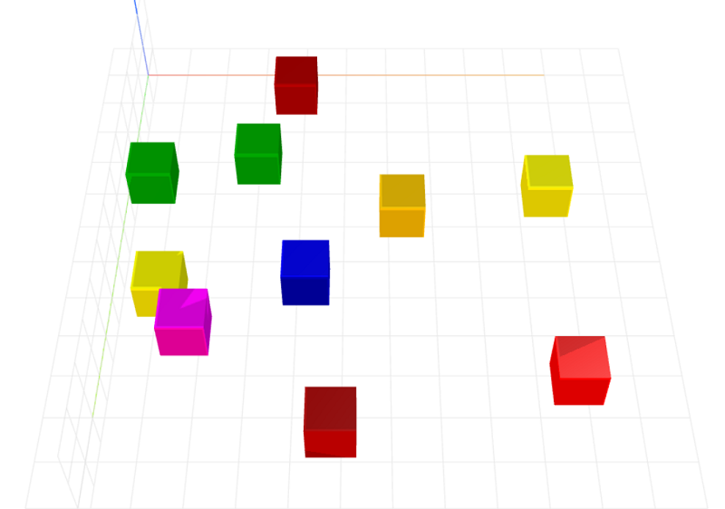

# randomize-layout
Randomize layout for CraftML

### Install
    $ npm install randomize-layout

### Parameters
- xspace: maximum x-coordinate at which an item can be placed
- yspace: maximum y-coordinate at which an item can be placed

### Example
```html
<craft>
    <craft name="randomize-layout" module="randomize-layout"/>
    
    <randomize-layout>
        <repeat n="10">
            <cube></cube>
        </repeat>
    </randomize-layout> 

</craft>
```


